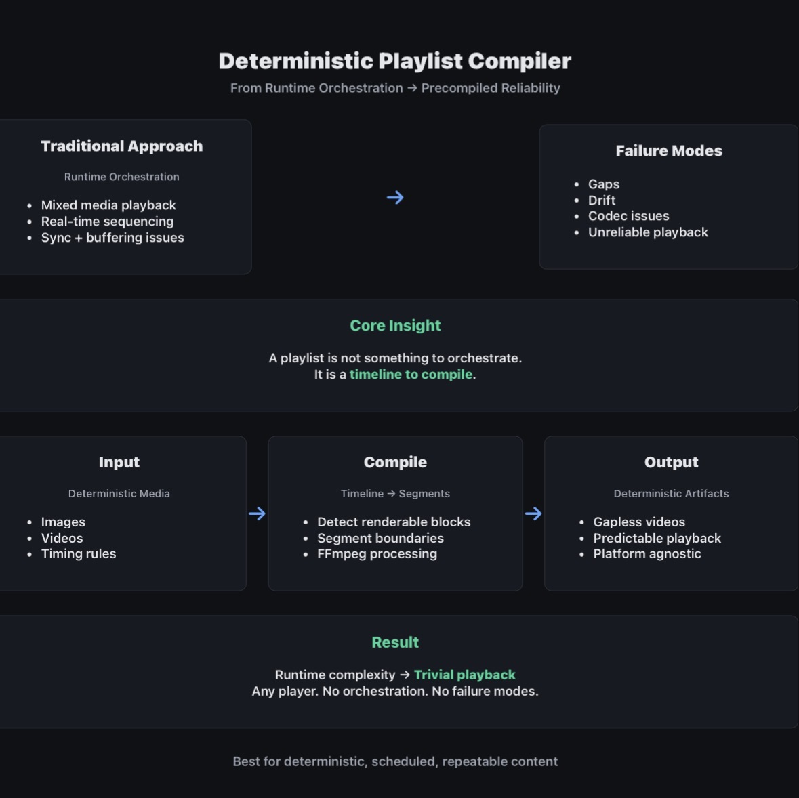

# Deterministic Playlist Compiler for Digital Signage

A system for compiling heterogeneous media playlists into **gapless, deterministic video outputs**.

👉 Live Demo  
https://benneberg.github.io/signage-video-fusion/

---

## 1. Problem

Digital signage systems treat playback as a **runtime orchestration problem**:
- Mixed media (images, videos, web, feeds)
- Sequenced and synchronized in real time

This creates failure modes:
- Playback gaps
- Buffering delays
- Ordering inconsistencies
- Codec/runtime incompatibilities

Yet most signage content is:

> **Deterministic, scheduled, and repeatable**

---

## 2. Insight

If content is deterministic, **playback should not be a runtime problem**.

It should be a **compilation problem**.

> A playlist is not a sequence to orchestrate  
> → it is a timeline to render

---

## 3. Solution

Treat playlists as **compile targets**, not runtime instructions.

Compile:
- heterogeneous media  
→ into  
- one or more **gapless video artifacts**

Result:
- Playback becomes trivial
- No runtime orchestration needed
- Platform-agnostic delivery

---

## 4. Evidence (Technical Validation)

Working system implemented in-browser:

- FFmpeg.wasm used for video compilation
- Mixed media playlists supported
- Automatic segmentation for non-renderable items
- Produces gapless MP4 outputs

👉 Live tool:  
https://benneberg.github.io/signage-video-fusion/#/merge

This demonstrates:
- Feasibility of browser-based compilation
- Deterministic timeline → video pipeline
- Real-world usability

---

## 5. Impact

This approach shifts signage systems from:

**Runtime complexity → Precompiled reliability**

Benefits:
- Deterministic playback (no gaps, no drift)
- Reduced system complexity
- Lower runtime requirements (even low-end players work)
- Easier distribution (just video files)

> The exception (live/interactive content) should not define the system.

---

## 6. System Model

The system behaves like a compiler:
Input:
Media + timing + ordering

↓ Compile

Intermediate:
Deterministic timeline
	•	segment boundaries

↓ Render

Output:
Gapless video artifacts
---

## 7. When This Approach Wins

Best suited for content that is:

- Deterministic
- Scheduled
- Repeatable

Falls back to traditional playlists when:
- Content is live
- Content is interactive
- Content is conditional

---

## 8. Features

### 🎬 Video Merger
- Merge multiple videos
- Browser-based FFmpeg processing

### 🖼️ Image → Video
- Configurable durations
- Resolution + FPS control
- Aspect ratio presets
- Ken Burns effect

### 📋 Playlist Compiler
- Mixed media playlists
- Drag-and-drop ordering
- JSON import/export
- Automatic segmentation
- Gapless video rendering

---

## 9. Tech Stack

- React + TypeScript
- Vite
- Tailwind CSS
- FFmpeg.wasm
- Framer Motion

---

## 10. Status

**Prototype / Validated Concept**

Core functionality works end-to-end.

---

## 11. Handoff Potential

This system is ready for:

- Integration into signage platforms
- Use as a preprocessing layer
- Expansion into cloud-based compilation pipelines
- Automation via API

---

## 12. Author Context

This project represents a **0→1 system design + validation**:

- Problem identified in real-world signage systems
- Alternative model designed
- Technical feasibility proven

Focus:
→ concept  
→ architecture  
→ validation  

Not long-term product ownership.

## 13. Example Output

Example:
- Input: 10 images + 2 videos + 1 webpage
- Output:
  - video_part_1.mp4
  - (web content live)
  - video_part_2.mp4

Total playback: gapless except intentional live segments
---

## License

MIT
